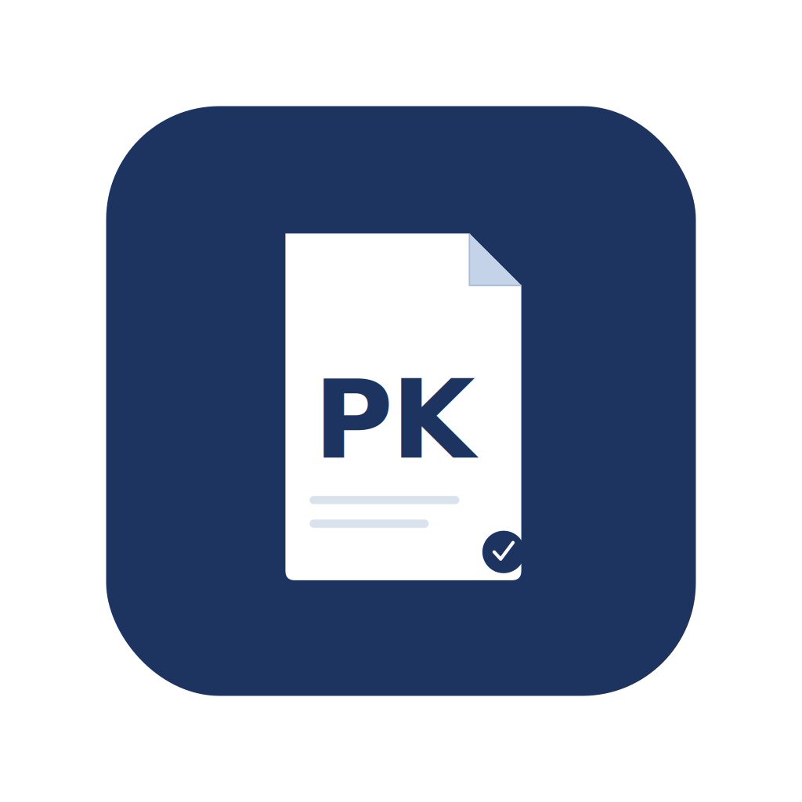

<div align="center">



# PaperKit

**Academic PDF workflows, simplified.**

Free desktop application for researchers and students who manage large collections of research papers.

[](https://github.com/faridinho/PaperKit/releases/latest)
[](LICENSE)
[](https://github.com/faridinho/PaperKit/releases/latest)
[](https://github.com/faridinho/PaperKit/releases/latest)

[**⬇ Download for Windows**](https://github.com/faridinho/PaperKit/releases/latest) · [Report a bug](https://github.com/faridinho/PaperKit/issues) · [Request a feature](https://github.com/faridinho/PaperKit/issues)


</div>

---

## What is PaperKit?

If you work with research papers, you know the problem. Your downloads folder is full of files named `paper_final_v3.pdf`, `download (1).pdf`, and `arxiv_2301.07041.pdf`. You have hundreds of PDFs with no structure, metadata buried inside them, and figures you need to extract one by one.

PaperKit fixes all of that. It is a free Windows desktop application that automates the most repetitive PDF tasks researchers face — without ever touching your original files.

---

## Features

### 📄 Rename PDFs by Title
PaperKit reads the actual title embedded inside each PDF and renames the file automatically. Drop in a folder of 200 papers and get them all properly named in seconds. Duplicate detection is built in so nothing gets overwritten.

### 🗜️ Compress PDFs
Reduce file sizes using quality profiles tuned for academic documents. Useful for email attachments, journal submission systems with upload limits, or simply keeping a large library manageable on disk.

### 📊 Export Metadata to Excel
Select any batch of papers and export their metadata — title, authors, year, keywords, and more — directly into a structured `.xlsx` spreadsheet. Built for systematic reviews, literature tracking, and citation management.

### 📎 Export Citations (RIS & BibTeX)
Automatically generate `.ris` and `.bib` citation files from the metadata embedded in your PDFs. Import directly into Zotero, Mendeley, EndNote, or any reference manager that accepts standard formats.

### 🖼️ Extract Embedded Images
Preview every image embedded inside a PDF and choose exactly which ones to extract. Outputs full-resolution files — ideal for reusing figures from published papers in your own presentations or manuscripts.

---

## Download & Install

No installation required. PaperKit ships as a standalone `.exe` — just download, unzip, and run.

**[⬇ Download the latest release →](https://github.com/faridinho/PaperKit/releases/latest)**

1. Download `PaperKit-v1.2.0-windows.zip` from the releases page
2. Extract the zip to any folder
3. Run `PaperKit.exe`

> **Note:** Windows may show a SmartScreen warning on first launch because the app is not code-signed. Click **"More info" → "Run anyway"** to proceed. This is normal for open-source desktop software distributed without a paid certificate.

**System requirements:** Windows 10 or 11 (64-bit)

---

## How It Works

PaperKit is designed around one principle: **your original files are never modified.** Every workflow operates on a copy of your files and writes output to a folder you choose. You can always undo anything by simply deleting the output folder.

```
Your PDFs  →  PaperKit  →  Output folder (copies)
                ↑
         Originals untouched
```

All processing happens locally on your machine. No internet connection is required, no data is uploaded anywhere, and no account is needed.

---

## Screenshots

| Rename | Metadata Export |
|--------|----------------|
|  |  |

| Image Extraction | Citations |
|-----------------|-----------|
|  |  |

---

## Frequently Asked Questions

**Will it modify or delete my original PDFs?**
No. PaperKit always works on copies. Your original files are never moved, renamed, or modified unless you explicitly point the output folder to the same location.

**Does it work offline?**
Yes, completely. PaperKit runs entirely on your local machine with no internet connection required.

**What if the PDF has no embedded title?**
PaperKit will flag it and skip renaming for that file. You will see a clear indicator in the UI for files where no title could be detected.

**My antivirus flagged the .exe — is it safe?**
Yes. False positives are common with PyInstaller-packaged Python applications because the bundled runtime looks unfamiliar to some antivirus engines. The full source code is available in this repository for anyone to inspect.

**Is it really free?**
Yes. Free to use, free forever, MIT licensed. No premium tier, no nag screens, no telemetry.

---

## Roadmap

- [ ] macOS support
- [ ] Batch citation export with custom templates
- [ ] Folder watcher (auto-rename on new downloads)
- [ ] Dark / light theme toggle per-session
- [ ] Drag-and-drop from file explorer (in progress)

---

## License

PaperKit is released under the [MIT License](LICENSE).  
© 2026 Farid Gazani

---

<div align="center">

Made for researchers, by a researcher. If PaperKit saves you time, consider giving the repo a ⭐ — it helps others find it.

</div>
