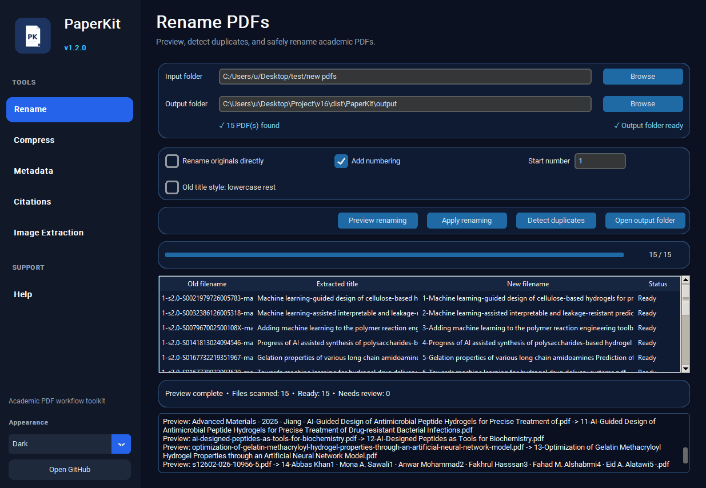
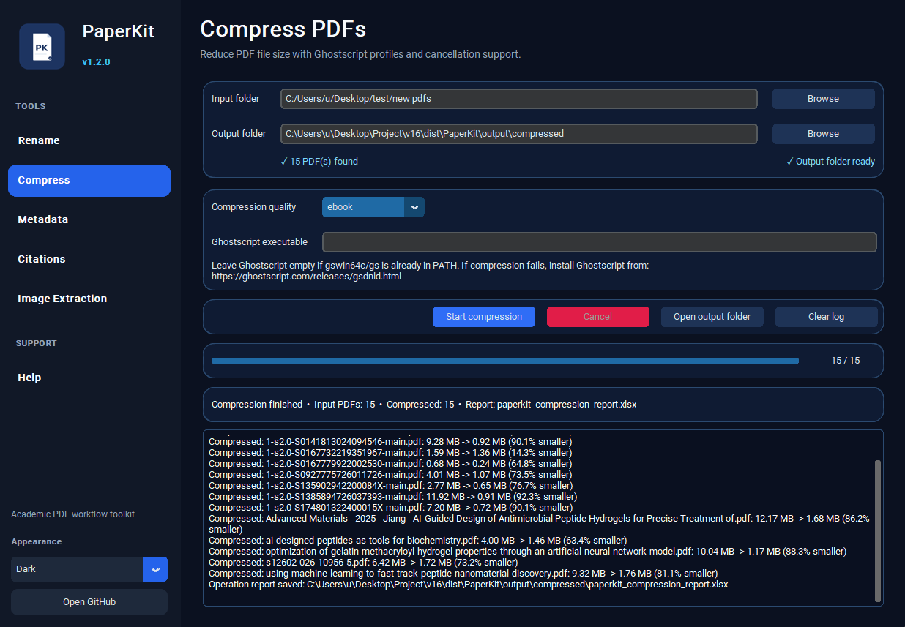
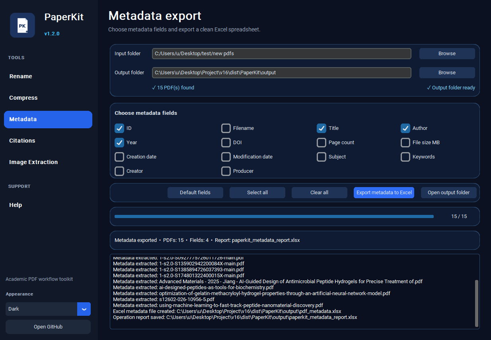
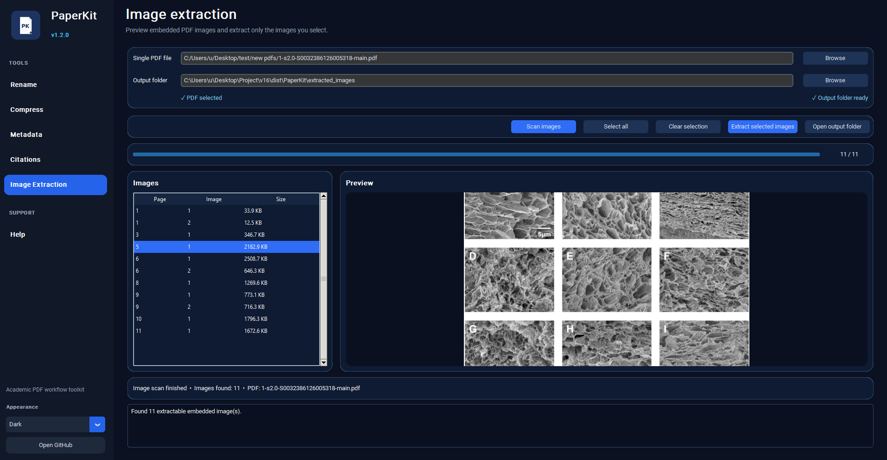

<p align="center">
  
</p>

<h1 align="center">PaperKit</h1>

<p align="center">
  Academic PDF workflow toolkit for researchers, students, and scientists.
</p>

<p align="center">
  Rename PDFs · Compress PDFs · Export metadata · Generate citations · Detect duplicates · Extract images
</p>

---

## Overview

**PaperKit** is a desktop application designed to make academic PDF workflows faster, safer, and more organized.

It helps researchers, students, and scientists manage collections of research papers by providing tools for:

- Renaming PDFs using extracted paper titles
- Previewing filenames before applying changes
- Detecting duplicate PDF files
- Compressing PDFs in batch
- Exporting metadata to Excel
- Generating RIS and BibTeX citation files
- Extracting selected embedded images from PDF papers

PaperKit is designed to be safe by default. It does **not** modify original files unless the user explicitly enables direct renaming.

---

## Why PaperKit?

Academic PDF collections can quickly become messy. Files often have names like:

```text
1-s2.0-S016777992200230-main.pdf
article.pdf
download.pdf
paper_final.pdf
```

PaperKit helps turn those files into cleaner, more useful names based on extracted titles.

PaperKit is also useful when preparing batches of papers for processing by an **AI agent**, large language model workflow, or document-analysis pipeline. Compressing a batch of PDFs can significantly reduce file size, making uploads faster and easier when sending many papers to an AI system for summarization, extraction, classification, or literature review support.

---

## Installation

Go to the **Releases** page and download:

```text
PaperKit-v1.2.0-Windows.zip
```

Extract the ZIP file and run:

```text
PaperKit.exe
```

> Important: Keep all files and folders together. Do not move only `PaperKit.exe` out of the folder.

---

## Features

### Rename PDFs

Rename academic PDFs using titles extracted from the PDF metadata or first page.

Features include:

- Preview before renaming
- Optional numbering
- Custom starting number
- Safe copy-based renaming
- Optional direct renaming of original files
- Excel operation report

Example output:

```text
1-Deep Learning for Medical Image Analysis.pdf
2-Privacy Concerns in AI-Based Shopping Systems.pdf
3-Hydrogel Drug Delivery Systems.pdf
```

---

### Duplicate Detection

Detect exact duplicate PDFs inside a folder.

PaperKit compares file content using hashing, not only filenames. This means it can detect duplicate PDFs even if they have different names.

Duplicate detection is available inside the Rename tab.

Output:

```text
duplicate_report.xlsx
```

PaperKit does not delete duplicates automatically. Users should review the report before removing files.

---

### Compress PDFs

Compress PDFs in batch using Ghostscript.

Compression can be especially useful when preparing a large collection of papers for:

- AI-agent document processing
- Uploading papers to LLM tools
- Literature review workflows
- Cloud storage
- Email sharing
- Archiving large PDF collections

Compression quality options include:

- `screen` — smallest file size, lower quality
- `ebook` — balanced quality and size
- `printer` — higher quality
- `prepress` — highest quality, larger output

Output:

```text
compressed/
paperkit_compression_report.xlsx
```

> **Note:** PDF compression requires Ghostscript.

Download Ghostscript here:

https://ghostscript.com/releases/gsdnld.html

Rename, metadata export, citation export, duplicate detection, and image extraction do **not** require Ghostscript.

---

### Metadata Export

Export selected PDF metadata fields to Excel.

Available fields may include:

- ID
- Filename
- Title
- Author
- Year
- DOI
- Page count
- File size

Output:

```text
pdf_metadata.xlsx
paperkit_metadata_report.xlsx
```

Metadata quality depends on the information stored in the PDF. Some PDFs contain incomplete or incorrect metadata, so users should review the Excel file before relying on it for formal academic records.

---

### Citation Export

Generate citation files automatically from extracted PDF metadata.

Supported formats:

- RIS
- BibTeX

RIS files can be imported into tools such as:

- Mendeley
- EndNote
- Zotero
- RefWorks

BibTeX files can be used with:

- LaTeX
- JabRef
- Zotero
- Mendeley

Output:

```text
paperkit_citations.ris
paperkit_citations.bib
paperkit_citation_report.xlsx
```

> Citation quality depends on PDF metadata quality. Always review imported records in your reference manager.

---

### Image Extraction

Extract embedded images from a single PDF.

Features include:

- Scan PDF images before extraction
- Preview selected images
- Select specific images to extract
- Extract original embedded image bytes without resizing or recompression
- Export image extraction report

Output:

```text
extracted_images/
paperkit_image_extraction_report.xlsx
```

Some academic figures are stored as vector graphics rather than embedded raster images. These may be visible in the PDF but may not appear in the image extraction list.

---


## Screenshots

Add screenshots to the repository in:

```text
docs/screenshots/
```

Example README links:

```markdown





```

---


## Notes on Safety

PaperKit is designed to avoid accidental changes to original files.

By default, users should use preview and copy-based workflows before applying changes. Direct renaming of original files should only be used after carefully reviewing the preview table.

---

## License

PaperKit is released under the MIT License.

See the `LICENSE` file for details.

---

## Author

Developed by **Farid Gazani**.

---

## Project Goal

PaperKit is built to support researchers, students, and scientists who work with large collections of academic PDFs.

The goal is to make common PDF tasks faster, safer, and easier, especially for academic research workflows and AI-assisted document processing.
